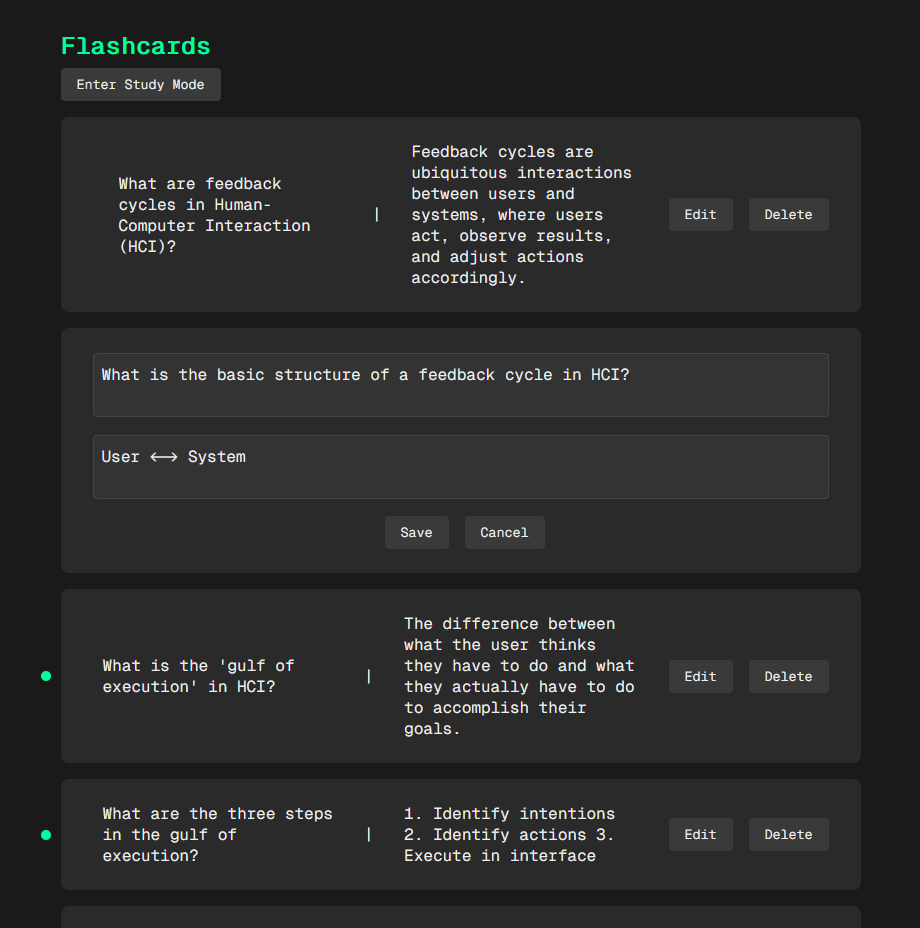

# flashcards

couldn't think of a better name for this project.

this is a simple flashcards app that uses anthropic's Claude API to generate flashcards from text.

create multiple decks, enter your notes, and it will generate flashcards for you based on them.

study the cards and mark them as learned or star them for future reference.

## Screenshots





## Running Locally

to run locally clone the repo and run `npm install` in the root and client folder.

run `npm run dev` in the client folder to start the next.js app

run `node index.js` in the root folder to start the server

you need to have an anthropic api key to use the app as well as a redis server running on your local machine to store the flashcard decks.

create a folder called `/config` with files `redis.json` and `anthropic.json`.

`anthropic.json` should look like:

```json
{
  "apiKey": ""
}           
```

`redis.json` should look like:

```json
{
  "host": "localhost",
  "port": 6379,
  "password": ""
}
```

You can leave the redis password blank if you don't have one set.

Also create a folder called `database` with a file called `flashcards.json` that looks like:

```json
{
  "decks": []
}
```

This will be used to backup the flashcard decks periodically.